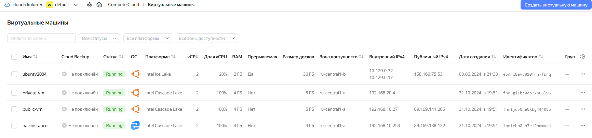
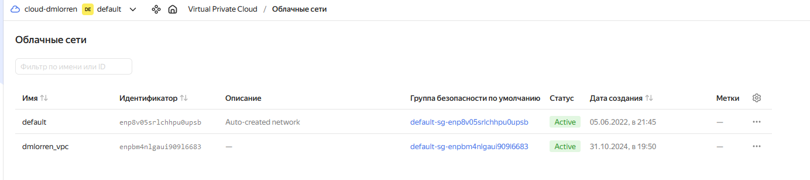
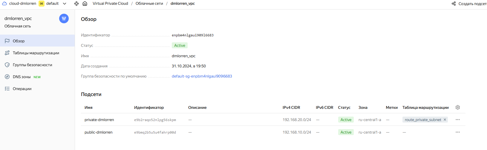
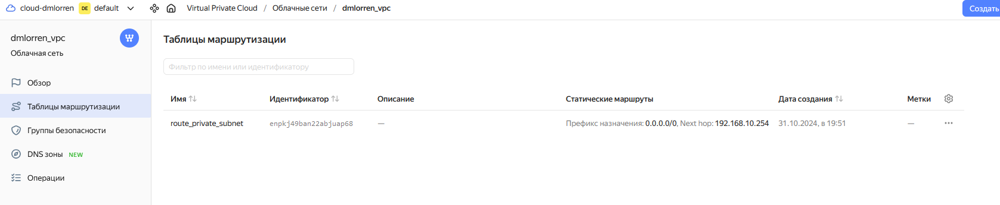
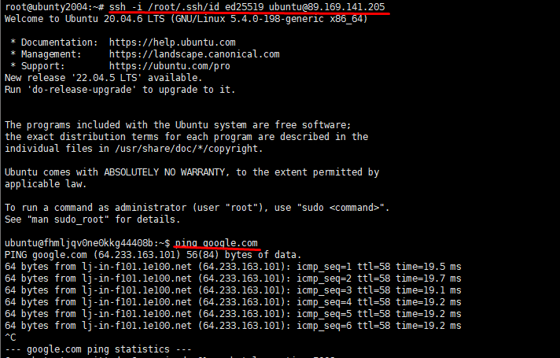
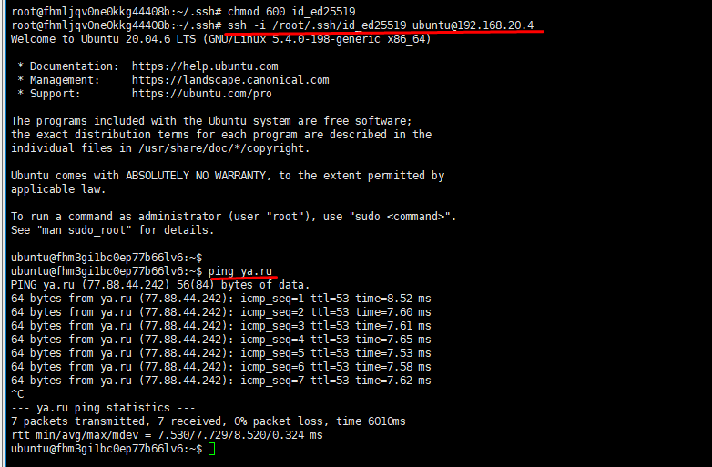

# Домашнее задание к занятию «Организация сети» - Иванов Дмитрий (fops-13)

### Подготовка к выполнению задания

1. Домашнее задание состоит из обязательной части, которую нужно выполнить на провайдере Yandex Cloud, и дополнительной части в AWS (выполняется по желанию). 
2. Все домашние задания в блоке 15 связаны друг с другом и в конце представляют пример законченной инфраструктуры.  
3. Все задания нужно выполнить с помощью Terraform. Результатом выполненного домашнего задания будет код в репозитории. 
4. Перед началом работы настройте доступ к облачным ресурсам из Terraform, используя материалы прошлых лекций и домашнее задание по теме «Облачные провайдеры и синтаксис Terraform». Заранее выберите регион (в случае AWS) и зону.

---
### Задание 1. Yandex Cloud 

**Что нужно сделать**

1. Создать пустую VPC. Выбрать зону.
2. Публичная подсеть.

 - Создать в VPC subnet с названием public, сетью 192.168.10.0/24.
 - Создать в этой подсети NAT-инстанс, присвоив ему адрес 192.168.10.254. В качестве image_id использовать fd80mrhj8fl2oe87o4e1.
 - Создать в этой публичной подсети виртуалку с публичным IP, подключиться к ней и убедиться, что есть доступ к интернету.
3. Приватная подсеть.
 - Создать в VPC subnet с названием private, сетью 192.168.20.0/24.
 - Создать route table. Добавить статический маршрут, направляющий весь исходящий трафик private сети в NAT-инстанс.
 - Создать в этой приватной подсети виртуалку с внутренним IP, подключиться к ней через виртуалку, созданную ранее, и убедиться, что есть доступ к интернету.

Resource Terraform для Yandex Cloud:

- [VPC subnet](https://registry.terraform.io/providers/yandex-cloud/yandex/latest/docs/resources/vpc_subnet).
- [Route table](https://registry.terraform.io/providers/yandex-cloud/yandex/latest/docs/resources/vpc_route_table).
- [Compute Instance](https://registry.terraform.io/providers/yandex-cloud/yandex/latest/docs/resources/compute_instance).

---


Ответ:

1. готовим наши манифесты согласно требованиям:

[vm.tf](./src/vm.tf)
[vpc_subnet.tf](./src/vpc_subnet.tf)
[providers.tf](./src/providers.tf)
[nat_instance.tf](./src/nat_instance.tf)
[locals.tf](./src/locals.tf)
[variables.tf](./src/variables.tf)

2. проверяем в яндекс-cloud что всё поднялось корректно:









3. подключаемся к public машине и проверяем выход в интернет
```
root@ubunty2004:~# ssh -i /root/.ssh/id_ed25519 ubuntu@89.169.141.205
```



4. теперь с public машины подключаемся к private (подготовительно перекинув на public наш ключ) и проверяем выход в интернет
```
ssh -i /root/.ssh/id_ed25519 ubuntu@192.168.20.4
```


---