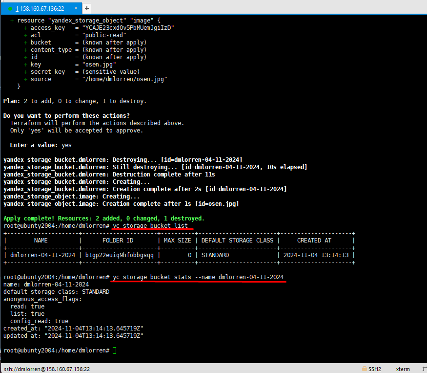

# Домашнее задание к занятию «Вычислительные мощности. Балансировщики нагрузки»  - Иванов Дмитрий (fops-13)

### Подготовка к выполнению задания

1. Домашнее задание состоит из обязательной части, которую нужно выполнить на провайдере Yandex Cloud, и дополнительной части в AWS (выполняется по желанию). 
2. Все домашние задания в блоке 15 связаны друг с другом и в конце представляют пример законченной инфраструктуры.  
3. Все задания нужно выполнить с помощью Terraform. Результатом выполненного домашнего задания будет код в репозитории. 
4. Перед началом работы настройте доступ к облачным ресурсам из Terraform, используя материалы прошлых лекций и домашних заданий.

---
## Задание 1. Yandex Cloud 

**Что нужно сделать**

1. Создать бакет Object Storage и разместить в нём файл с картинкой:

 - Создать бакет в Object Storage с произвольным именем (например, _имя_студента_дата_).
 - Положить в бакет файл с картинкой.
 - Сделать файл доступным из интернета.
 
2. Создать группу ВМ в public подсети фиксированного размера с шаблоном LAMP и веб-страницей, содержащей ссылку на картинку из бакета:

 - Создать Instance Group с тремя ВМ и шаблоном LAMP. Для LAMP рекомендуется использовать `image_id = fd827b91d99psvq5fjit`.
 - Для создания стартовой веб-страницы рекомендуется использовать раздел `user_data` в [meta_data](https://cloud.yandex.ru/docs/compute/concepts/vm-metadata).
 - Разместить в стартовой веб-странице шаблонной ВМ ссылку на картинку из бакета.
 - Настроить проверку состояния ВМ.
 
3. Подключить группу к сетевому балансировщику:

 - Создать сетевой балансировщик.
 - Проверить работоспособность, удалив одну или несколько ВМ.
4. (дополнительно)* Создать Application Load Balancer с использованием Instance group и проверкой состояния.

Полезные документы:

- [Compute instance group](https://registry.terraform.io/providers/yandex-cloud/yandex/latest/docs/resources/compute_instance_group).
- [Network Load Balancer](https://registry.terraform.io/providers/yandex-cloud/yandex/latest/docs/resources/lb_network_load_balancer).
- [Группа ВМ с сетевым балансировщиком](https://cloud.yandex.ru/docs/compute/operations/instance-groups/create-with-balancer).


Ответ:

- список используемых команд:
```
terraform init
terraform apply
terraform validate
terraform plan

yc config set service-account-key /home/dmlorren/key.json
yc load-balancer network-load-balancer list
yc load-balancer network-load-balancer target-states --id enpeb5l1s3qgivn9a1q9 --target-group-id enpnrqpc7h7h179bramo
yc load-balancer network-load-balancer get --name lamp-balancer
yc compute instance list
```

- подготовленные манифесты:
[storage_bucket.tf](./src/storage_bucket.tf)
[providers.tf](./src/providers.tf)
[vm.tf](./src/vm.tf)
[vpc_local.tf](./src/vpc_local.tf)
[net_load_balancer.tf](./src/net_load_balancer.tf)
[variables.tf](./src/variables.tf)
[upload_img.tf](./src/upload_img.tf)


1. Создаём бакет в Object Storage с инициалами и датой согласно требованиям, там же грузим нашу картинку.
Источником картинки будет файл, лежащий в домашней директории за публичность картинки будет отвечать параметр acl = "public-read".


Проверяем созданный бакет:



2. Создаём группу виртуальных машин в public подсети фиксированного размера с шаблоном LAMP и веб-страницей, содержащей ссылку на картинку из бакета.


```
root@ubunty2004:/home/dmlorren# yc compute instance list
+----------------------+---------------------------+---------------+---------+----------------+-------------+
|          ID          |           NAME            |    ZONE ID    | STATUS  |  EXTERNAL IP   | INTERNAL IP |
+----------------------+---------------------------+---------------+---------+----------------+-------------+
| epdrc8ev8810fnn7fsrq | ubunty2004                | ru-central1-b | RUNNING | 158.160.67.136 | 10.129.0.32 |
| fhm2n0glco6ps06eovd7 | cl1ik213q7260tvvk9gp-yleb | ru-central1-a | RUNNING | 89.169.153.231 | 10.0.1.22   |
| fhm7qtgaeqjfrhnat6ob | cl1ik213q7260tvvk9gp-atap | ru-central1-a | RUNNING | 51.250.67.241  | 10.0.1.5    |
| fhmh3rulcopbu6ro4tcm | cl1ik213q7260tvvk9gp-ebyf | ru-central1-a | RUNNING | 89.169.148.205 | 10.0.1.32   |
+----------------------+---------------------------+---------------+---------+----------------+-------------+
```

3. Проверяем статус балансировщика нагрузки и подключенной к нему группе виртуальных машин:


4. Для того чтобы проверить доступность сайта через через балансировщик нагрузки предварительно необходимо найти его внешний ip.


5. Проверяем доступность:


6. Останавливаем одну из нод и убеждаемся, что наш сайт доступен.


---

