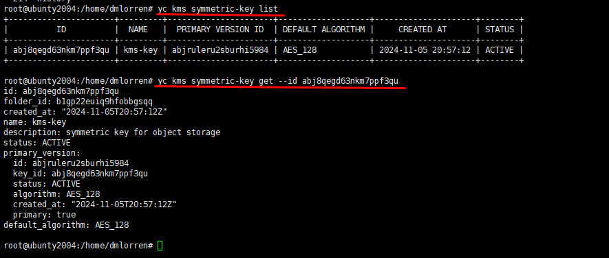
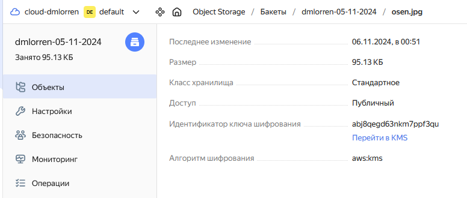
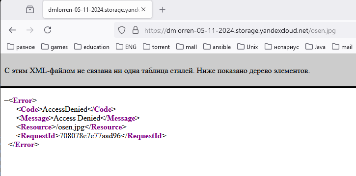

# Домашнее задание к занятию «Безопасность в облачных провайдерах»  - Иванов Дмитрий (fops-13)

Используя конфигурации, выполненные в рамках предыдущих домашних заданий, нужно добавить возможность шифрования бакета.

---
## Задание 1. Yandex Cloud   

1. С помощью ключа в KMS необходимо зашифровать содержимое бакета:

 - создать ключ в KMS;
 - с помощью ключа зашифровать содержимое бакета, созданного ранее.
2. (Выполняется не в Terraform)* Создать статический сайт в Object Storage c собственным публичным адресом и сделать доступным по HTTPS:

 - создать сертификат;
 - создать статическую страницу в Object Storage и применить сертификат HTTPS;
 - в качестве результата предоставить скриншот на страницу с сертификатом в заголовке (замочек).

Полезные документы:

- [Настройка HTTPS статичного сайта](https://cloud.yandex.ru/docs/storage/operations/hosting/certificate).
- [Object Storage bucket](https://registry.terraform.io/providers/yandex-cloud/yandex/latest/docs/resources/storage_bucket).
- [KMS key](https://registry.terraform.io/providers/yandex-cloud/yandex/latest/docs/resources/kms_symmetric_key).

--- 

Ответ:
Домашнее задание выполняется на основании манифестов от прошлых работ, но с рядом доработок, а именно:
1. для экономии не используются ресурсы которые не требуются для выполнения текущего ДЗ;
2. задействован новый ключ шифрования:
```
resource "yandex_kms_symmetric_key" "key-a" {
  name              = var.kms_key_name
  description       = var.kms_key_description
  default_algorithm = var.default_algorithm
  lifecycle {
    prevent_destroy = false
  }
}
```
3. бакет теперь создаётся с использованием симметричного ключа шифрования:
```
resource "yandex_storage_bucket" "dmlorren" {
  access_key            = yandex_iam_service_account_static_access_key.static-key.access_key
  secret_key            = yandex_iam_service_account_static_access_key.static-key.secret_key
  bucket                = local.bucket_name
  acl                   = "public-read"
  server_side_encryption_configuration {
         rule {
           apply_server_side_encryption_by_default {
             kms_master_key_id = yandex_kms_symmetric_key.key-a.id
             sse_algorithm     = "aws:kms"
       }
     }
   }
}
```
4. было ещё множество мелких исправлений по ходу выполнения задания, подробно они отражены в манифестах:

[providers.tf](./src/providers.tf)
[storage_bucket.tf](./src/storage_bucket.tf)
[variables.tf](./src/variables.tf)
[vpc_local.tf](./src/vpc_local.tf)


5. Выполняется блок команд и проводится анализ результата:
```
terraform init
terraform apply
terraform validate
terraform plan
yc kms symmetric-key list
yc kms symmetric-key get --id abj8qegd63nkm7ppf3qu
```





- в браузере убеждаемся, что файл зашифрован.


--- 